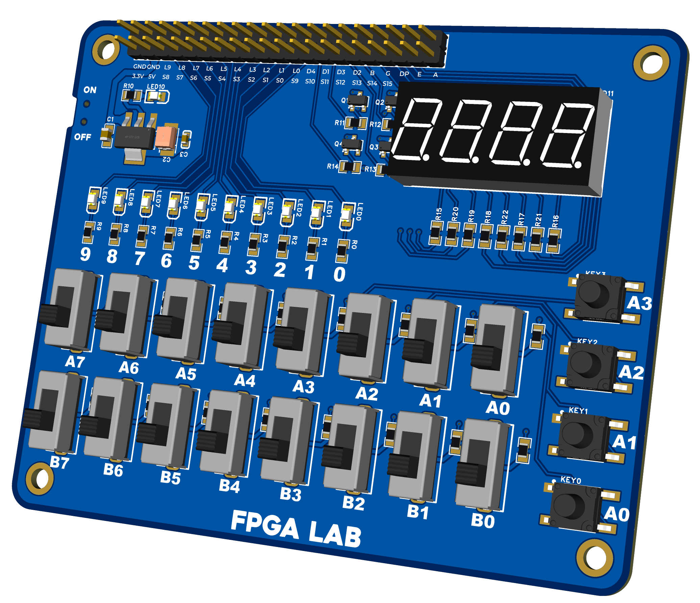

# FPGA Universal Expansion Board (FPGA LAB)

The **FPGA Universal Expansion Board**, also known as **FPGA LAB**, is a peripheral expansion board designed primarily for **educational FPGA practices**, although it can also be used for basic microcontroller testing.

The project was born from a common problem in digital design education: **low-cost development boards often lack sufficient peripherals** for introductory digital logic and digital electronics practices, while boards with complete peripherals tend to have a **high cost**.

This board seeks to offer an **affordable, open, and reusable** solution, allowing students to focus on **RTL design and logic**, rather than wiring or external adapters.

---

## Why “Universal”?

The term *universal* does not refer to compatibility with a specific FPGA model, but rather that the board:

- Operates entirely at **3.3 V**
- Exposes signals via **standard headers**
- Does not depend on a specific manufacturer or ecosystem

This allows its use with:
- FPGAs from different manufacturers
- Microcontrollers
- General digital logic projects

Originally, the board was intended for use with:
- **Intel Cyclone IV**
- **Gowin Tang Nano 9K**

---

## General Features

- 16 slide switches for digital input
- User LEDs with current-limiting resistors
- Multiplexed 7-segment display
- User buttons
- Standard headers for signal connection
- 3.3 V power supply
- Design optimized for low cost and easy manufacturing

---

## Revision 1 (Rev.1)

The first revision served as a **proof of concept** and design validation.

### Rev.1 Features
- Power via **USB-C**
- **AMS1117** regulator to generate 3.3 V
- 16 switches with pull-up resistors
- 4 buttons in parallel with the first 4 switches
- **7-segment, 3-digit display**, common anode, multiplexed
- 8 user LEDs
- 2 pairs of **3-pin** connectors (signal, 5 V, and GND)
- Full **3.3 V** operation

---

## Revision 1 (Usage Example, Board with Cyclone IV EP4CE115F29C8N)

  

---

## Revision 2 (Rev.2)

The **Rev.2** is an evolution of the design focused on:
- Improving electrical behavior
- More comfortable switches

### Main Changes in Rev.2
- Removal of the USB-C connector
- Direct pin power supply:
  - **5 V** input passing through an LDO to generate 3.3 V  
  - or direct **3.3 V** input
- 10 user LEDs
- **7-segment, 4-digit display**, common anode
- 16 slide switches
- Dedicated **Power ON** switch
- Forced default display power-off to avoid **ghosting**
- LED configuration in Source mode to avoid indeterminate states at power-up

This revision represents the **most mature and recommended** version of the project.

Images corresponding to this version are located in /rev2/images

---

## Educational Use

The board is intended for practices such as:

- Combinational logic
- Counters and registers
- Finite State Machines (FSM)
- Display multiplexing
- Handling mechanical inputs
- Introduction to RTL design and verification

The goal is for students to **experiment directly with real hardware**, maintaining a low-cost and easily accessible environment.

---

## Manufacturing

The design is optimized for:
- **2-layer** PCB
- Standard FR-4
- Low-cost manufacturing services
- Manual assembly or small series production

---

## License

This project is **Open Hardware**.

All hardware design files (schematics, PCB, and manufacturing data) are licensed under the **CERN Open Hardware Licence Version 2 – Strongly Reciprocal (CERN-OHL-S v2)**.

See the `LICENSE` file for the full text of the license.
