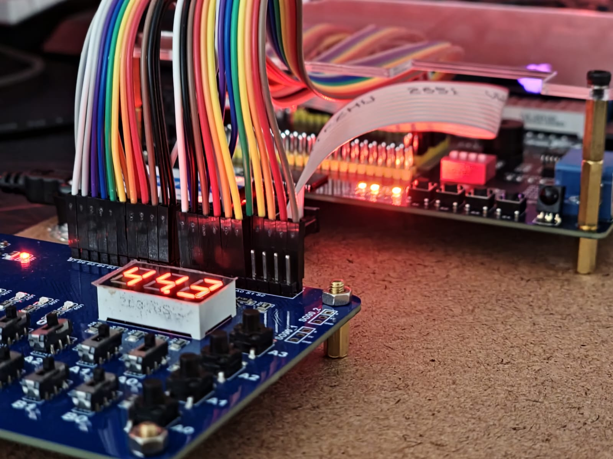
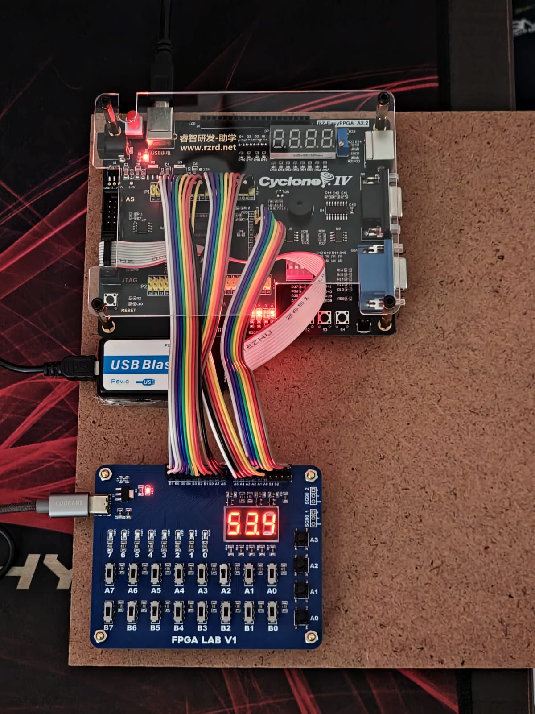

# FPGA Universal Expansion Board (FPGA LAB)

La **FPGA Universal Expansion Board**, también conocida como **FPGA LAB**, es una
tarjeta de expansión con periféricos diseñada principalmente para **prácticas
educativas con FPGAs**, aunque también puede utilizarse para pruebas básicas con
microcontroladores.

El proyecto nace a partir de una problemática común en la enseñanza del diseño
digital: las **placas de desarrollo de bajo costo suelen carecer de periféricos
suficientes** para prácticas de introducción a la lógica digital y electrónica
digital, mientras que las placas con periféricos completos suelen tener un
**costo elevado**.

Esta tarjeta busca ofrecer una solución **económica, abierta y reutilizable**,
permitiendo que el estudiante se concentre en el **diseño RTL y la lógica**, y no
en el cableado o adaptadores externos.

---

## ¿Por qué “Universal”?

El término *universal* no se refiere a compatibilidad con un modelo específico de
FPGA, sino a que la tarjeta:

- Opera completamente a **3.3 V**
- Expone las señales mediante **headers estándar**
- No depende de un fabricante o ecosistema específico

Esto permite su uso con:
- FPGAs de distintos fabricantes
- Microcontroladores
- Proyectos generales de lógica digital

Originalmente, la tarjeta fue planteada para su uso con:
- **Intel Cyclone IV**
- **Gowin Tang Nano 9K**

---

## Características generales

- 16 switches deslizables para entrada digital
- LEDs de usuario con resistencias limitadoras
- Display de 7 segmentos multiplexado
- Botones de usuario
- Headers estándar para conexión de señales
- Alimentación a 3.3 V
- Diseño optimizado para bajo costo y fácil fabricación

---

## Revisión 1 (Rev.1)

La primera revisión funcionó como **prueba de concepto** y validación del diseño.

### Características Rev.1
- Alimentación mediante **USB-C**
- Regulador **AMS1117** para generar 3.3 V
- 16 switches con resistencias pull-up
- 4 botones en paralelo con los primeros 4 switches
- Display de **7 segmentos, 3 dígitos**, ánodo común, multiplexado
- 8 LEDs de usuario
- 2 pares de conectores de **3 pines** (señal, 5 V y GND)
- Operación completa a **3.3 V**

---

## Revisión 1 (Ejemplo de uso, Tajeta con Cyclone IV EP4CE115F29C8N)

---

## Revisión 2 (Rev.2)

La **Rev.2** es una evolución del diseño enfocada en:
- Mejorar el comportamiento eléctrico
- Simplificar el uso en laboratorio

### Cambios principales en Rev.2
- Eliminación del conector USB-C
- Alimentación directa por pin:
  - Entrada de **5 V** que pasa por un LDO para generar 3.3 V  
  - o entrada directa de **3.3 V**
- 10 LEDs de usuario
- Display de **7 segmentos, 4 dígitos**, ánodo común
- 16 switches deslizables
- Switch dedicado de **Power ON**
- Forzado del apagado por defecto del display para evitar **ghosting**
- Configuración de LEDs en modo Source para evitar estados indeterminados al encender

Esta revisión representa la versión **más madura y recomendada** del proyecto.

Las imágenes correspondientes a esta versión se encuentran en /rev2/images

---

## Uso educativo

La tarjeta está pensada para prácticas como:

- Lógica combinacional
- Contadores y registros
- Máquinas de estados finitos (FSM)
- Multiplexado de displays
- Manejo de entradas mecánicas
- Introducción al diseño y verificación RTL

El objetivo es que el alumno pueda **experimentar directamente con hardware
real**, manteniendo un entorno de bajo costo y fácil acceso.

---

## Fabricación

El diseño está optimizado para:
- PCB de **2 capas**
- FR-4 estándar
- Servicios de fabricación de bajo costo
- Ensamble manual o en pequeñas series

---

## Licencia

Este proyecto es **Open Hardware**.

Todos los archivos de diseño de hardware (esquemáticos, PCB y datos de fabricación)
están licenciados bajo la **CERN Open Hardware Licence Version 2 – Strongly Reciprocal (CERN-OHL-S v2)**.

Consulta el archivo `LICENSE` para el texto completo de la licencia.

